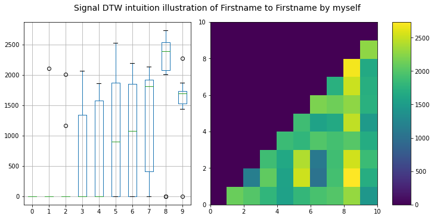

# `<center>` به نام خدا `</center>`

# `<center>` تمرین درس پردازش گفتار `</center>`

## `<center>` **استاد:** _دکتر بختیاری_ `</center>`

## `<center>` **دانشجو:** _سینا بهنام_ `</center>`

## `<center>` **تابستان 1400** `</center>`

</div>

<div dir="rtl">

این پروژه با استفاده از `jupyter notebook` در زبان برنامه نویسی پایتون پیاده سازی شده است .

### شرح پروژه :

در این پروژه با بکار گرفتن از ابزار `DTW` میزان تفاوت دو سیگنال صدا به صورت خام و بصورت برداری از ویژگی ها مورد بررسی قرار گرفته است .

ابتدا کتابخانه ها و ماژول های لازم را فراخوانی میکنیم.

</div>

```python
import numpy as np
import librosa
import glob
import matplotlib.pyplot as plt
import librosa.display as display
import pandas as pd
import xlsxwriter
import xlrd
import openpyxl
import sklearn.preprocessing

%matplotlib inline
```

<div dir="rtl">
ابتدا قبل از اماده سازی داده به یکی از مراحل ان توجه میکنیم که در ان سکوت هایی که باعث افزایش طول صوت و همچنین افزایش میزان

پردازش میشود جلوگیری میکنیم که برای ان از ابزار `trim` استفاده شده است .

در قسمت پایین صوتی اصلی را با حالت صوت بدون سکوت مقایسه شده است که نشان میدهد طول کاهش پیدا کرده است.

همچنین با استفاده از یک پنجره به طول `30ms` این بررسی وجود سکوت انجام گرفته شده است

و تمامی اصواتی که با قدرت زیر `10db` وجود داشته اند حذف شده است

</div>

```python
# trimming analysis
signal,samplerate = librosa.load('data/last_name_by_myself/lastname_001.wav',sr=22050,mono=True)

fig, ax = plt.subplots(2,1,constrained_layout=True)

fig.set_size_inches(16,5)

display.waveplot(signal,sr=22050,ax=ax[0])
ax[0].set(title="original signal")

print("duration : ",round(librosa.get_duration(signal),4))

# frame length : The number of samples per analysis frame (30ms = 661 samples) ~= N
# hop length : The number of samples between analysis frames (10ms = 220 samples) ~= M
# top_db : The threshold (in decibels) below reference to consider as silence

signal_trimmed,index = librosa.effects.trim(signal,top_db=10,frame_length=int(30e-3*samplerate),hop_length=int(10e-3*samplerate))

display.waveplot(signal_trimmed,sr=22050,ax=ax[1])
ax[1].set(title="trimmed signal")

print("trimmed duration : ",round(librosa.get_duration(signal_trimmed),4))

print("the interval of original signal corresponding to the non-silent region would start at : ",index[0]," and end at : ",index[1])
```

```
duration :  0.9218
trimmed duration :  0.6086
the interval of original signal corresponding to the non-silent region would start at :  440  and end at :  13860
```


<div dir="rtl">

#### توصیف داده : دادهایی که در این پروژه استفاده شده اند به قسمت کلی شامل صدا `سینا` و صدا `بهنام` تشکیل شده است که توسط دوشخص متفاوت ادا شده اند

هر یک از اشخاص ده بار صدا `سینا` ضبط شده است و ده بار `بهنام` و هر کدام دو به دو تحلیل شده اند و در نهایت میزان تفاوت ان با یک دیگر مقایسه شده است.

</div>

```python
data = 'data/'
lastname_bymyself_folder = data + 'last_name_by_myself/'
lastname_bymyself_file = glob.glob(lastname_bymyself_folder+'*.wav')

lastname_bymyself = []
for lastname_path in lastname_bymyself_file:
    signal,samplerate = librosa.load(lastname_path,sr=22050,mono=True)
    signal,index = librosa.effects.trim(signal,top_db=10,frame_length=int(30e-3*samplerate),hop_length=int(10e-3*samplerate))
    display.waveshow(signal)
    lastname_bymyself.append([signal,samplerate])

print("record number : ",len(lastname_bymyself))
```

```
record number :  10
```


<div dir="rtl">

تابع زیر میزان `DTW` بین دو فایل صوتی را تشخیص میدهد و در نهایت بهترین فاصله را به صورت یک مجموعه در قالب جدول نمایش میدهد

</div>

```python
def signal_dtw_calculation(y1,y2,is_equal=False,dtw_weight_path=None): 

    if(dtw_weight_path):
        return pd.read_excel(dtw_weight_path,index_col=0)
  
    record_number_y1 = len(y1)
    record_number_y2 = len(y2)

    if(is_equal):

        distances = np.zeros((record_number_y1, record_number_y2))
        for i in range(record_number_y1):
            for j in range(i+1, record_number_y2):
                x_1, fs = y1[i]
                x_2, fs = y2[j]
                D, wp = librosa.sequence.dtw(x_1, x_2)
                best_cost = D[-1, -1]
                distances[i][j] = round(best_cost, 3)

        distances = pd.DataFrame(distances)

        return distances


    distances = np.zeros((record_number_y1, record_number_y2))
    for i in range(record_number_y1):
        for j in range(record_number_y2):
            x_1, fs = y1[i]
            x_2, fs = y2[j]
            D, wp = librosa.sequence.dtw(x_1, x_2)
            best_cost = D[-1, -1]
            distances[i][j] = round(best_cost, 3)

    distances = pd.DataFrame(distances)
  
    return distances
```

<div dir="rtl">

میزان شباهت ادای صوت خام `بهنام` توسط خودم

همان طور که مشاهده میشود میزان `DTW` سیگنال زیاد میباشد و به خوبی قابل تفکیک نمیباشند

</div>

```python

signal_distances_lastname_lastname_bymyself = signal_dtw_calculation(lastname_bymyself,lastname_bymyself,is_equal=True,dtw_weight_path=lastname_bymyself_folder+'output/signal_distances_lastname_lastname_bymyself.xlsx')
signal_distances_lastname_lastname_bymyself
```

<div>
<style scoped>
    .dataframe tbody tr th:only-of-type {
        vertical-align: middle;
    }

```
.dataframe tbody tr th {
    vertical-align: top;
}

.dataframe thead th {
    text-align: right;
}
```

</style>
<table border="1" class="dataframe">
  <thead>
    <tr style="text-align: right;">
      <th></th>
      <th>0</th>
      <th>1</th>
      <th>2</th>
      <th>3</th>
      <th>4</th>
      <th>5</th>
      <th>6</th>
      <th>7</th>
      <th>8</th>
      <th>9</th>
    </tr>
  </thead>
  <tbody>
    <tr>
      <th>0</th>
      <td>0</td>
      <td>848.716</td>
      <td>1008.144</td>
      <td>1240.776</td>
      <td>1305.755</td>
      <td>1243.724</td>
      <td>1040.890</td>
      <td>1315.072</td>
      <td>1480.996</td>
      <td>1329.427</td>
    </tr>
    <tr>
      <th>1</th>
      <td>0</td>
      <td>0.000</td>
      <td>1014.244</td>
      <td>1213.117</td>
      <td>1212.691</td>
      <td>1220.273</td>
      <td>964.352</td>
      <td>1273.261</td>
      <td>1392.649</td>
      <td>1297.726</td>
    </tr>
    <tr>
      <th>2</th>
      <td>0</td>
      <td>0.000</td>
      <td>0.000</td>
      <td>1320.593</td>
      <td>1439.262</td>
      <td>1394.256</td>
      <td>1158.300</td>
      <td>1369.722</td>
      <td>1490.365</td>
      <td>1436.390</td>
    </tr>
    <tr>
      <th>3</th>
      <td>0</td>
      <td>0.000</td>
      <td>0.000</td>
      <td>0.000</td>
      <td>1125.506</td>
      <td>1352.069</td>
      <td>1253.510</td>
      <td>1393.819</td>
      <td>1424.594</td>
      <td>1107.705</td>
    </tr>
    <tr>
      <th>4</th>
      <td>0</td>
      <td>0.000</td>
      <td>0.000</td>
      <td>0.000</td>
      <td>0.000</td>
      <td>874.804</td>
      <td>908.985</td>
      <td>1336.700</td>
      <td>1556.205</td>
      <td>846.317</td>
    </tr>
    <tr>
      <th>5</th>
      <td>0</td>
      <td>0.000</td>
      <td>0.000</td>
      <td>0.000</td>
      <td>0.000</td>
      <td>0.000</td>
      <td>933.461</td>
      <td>1653.566</td>
      <td>1768.868</td>
      <td>1143.542</td>
    </tr>
    <tr>
      <th>6</th>
      <td>0</td>
      <td>0.000</td>
      <td>0.000</td>
      <td>0.000</td>
      <td>0.000</td>
      <td>0.000</td>
      <td>0.000</td>
      <td>1218.390</td>
      <td>1429.339</td>
      <td>1082.597</td>
    </tr>
    <tr>
      <th>7</th>
      <td>0</td>
      <td>0.000</td>
      <td>0.000</td>
      <td>0.000</td>
      <td>0.000</td>
      <td>0.000</td>
      <td>0.000</td>
      <td>0.000</td>
      <td>1408.016</td>
      <td>1472.040</td>
    </tr>
    <tr>
      <th>8</th>
      <td>0</td>
      <td>0.000</td>
      <td>0.000</td>
      <td>0.000</td>
      <td>0.000</td>
      <td>0.000</td>
      <td>0.000</td>
      <td>0.000</td>
      <td>0.000</td>
      <td>1580.603</td>
    </tr>
    <tr>
      <th>9</th>
      <td>0</td>
      <td>0.000</td>
      <td>0.000</td>
      <td>0.000</td>
      <td>0.000</td>
      <td>0.000</td>
      <td>0.000</td>
      <td>0.000</td>
      <td>0.000</td>
      <td>0.000</td>
    </tr>
  </tbody>
</table>
</div>

<div dir="rtl">

در شکل زیر سعی شده است تا اطلاعاتی از نمای کلی از مقدار تفاوت بین سیگنال نمونه نشان میدهد و در نمودار اول به صورت جبعی و در نمودار دوم به صورت نمایش رنگدار که هر نمونه نسبت به دیگر با چه شدتی با هم متشابه هستند و هر چه این مقدار کمتر باشد میزان شباهت بین نمونه ها بیشتر است .

</div>

```python
fig, ax = plt.subplots(1,2,constrained_layout=True)

fig.set_size_inches(10,5)
fig.suptitle("Signal DTW intuition illustration of Lastname to Lastname by myself", fontsize=14)

signal_distances_lastname_lastname_bymyself.boxplot(ax=ax[0])

img = ax[1].pcolormesh(signal_distances_lastname_lastname_bymyself.to_numpy())
fig.colorbar(img, ax=[ax[1]])
```

```
<matplotlib.colorbar.Colorbar at 0x2a7ddf98d90>
```


<div dir="rtl">

به علت حجم بالای محاسبات سیگنال خام نتیجه ان یک خروجی `exel` گرفته میشود تا در دفعات بعد نیاز به اجرا الگوریتم نباشد .

</div>

```python
# repoting out of dwt 
signal_distances_lastname_lastname_bymyself.to_excel(lastname_bymyself_folder+'output/signal_distances_lastname_lastname_bymyself.xlsx', engine='xlsxwriter')
```

<div dir="rtl">

همان طور که مشاهده شد میزان شباهت به شکل صحیح و قابل تفکیکی انجام نشده و لذا نیاز است با استفاده از استخراج بعضی از ویژگی های صوت انرا قابل تشخیص تر برای سیستم کنیم

## ویژگی های استفاده شده :

1. MFCC
2. مشتق اول **MFCC**
3. مشتق دوم **MFCC**
4. عبور از صفر (ZCR)
5. انرژی سیگنال (RMS)

### نکته : برای انجام استخراج ویژگی نیاز به انجام دو مرحله پیشنیاز **frame** بندی و پنجره گذاری نیاز میاشد

که برای فریم بندی مانند بخش ایجاد سکوت از دو پارامتر زیر استفاده میشود :

1. frame_length = 30ms -> که معرف 661 نمونه
2. hop_length = 10ms -> که معرف 220 نمونه میباشد

### نکته : تعداد نمونه های بالا از طریق ضرب طول زمانی در فرکانس نمونه برداری انجام میشود

</div>

```python
# feature extraction 
frame_length = int(30e-3*samplerate) # 30ms
hop_length = int(10e-3*samplerate) # 10ms

lastname_bymyself_features = []

for signal,samplerate in lastname_bymyself:
    mfcc = librosa.feature.mfcc(signal,samplerate,n_mfcc=13,hop_length=hop_length,n_fft=frame_length,window=np.hamming(frame_length))
    mfcc_delta = librosa.feature.delta(mfcc)
    mfcc_delta2 = librosa.feature.delta(mfcc,order=2)
    zcr = librosa.feature.zero_crossing_rate(signal,frame_length=frame_length,hop_length=hop_length)
    rms = librosa.feature.rms(signal,frame_length=frame_length,hop_length=hop_length)
    feature = np.concatenate([mfcc,mfcc_delta,mfcc_delta2,zcr,rms])
    lastname_bymyself_features.append(feature)

lastname_bymyself_features[0].shape
```

```
(41, 61)
```

<div dir="rtl">

به طور کلی برای دریافت نمونه بهتر قبل از پردازش و کاهش حجم محاسبات میتوان از نرمال سازی داده بهره گرفت که در تابع زیر به بررسی تاثیر نرمال توجه شده است .

نرمال سازی زیر به صورت **Standard Scrore** انجام شده است اما مدل های دیگر نرمال سازی نیز میباشد که برخی از انها در لیست زیر اماده است و فقط نیاز به تغییر پارامتر `scaler` توسط کتابخانه `sikit-learn`  دارد .

1. MinMaxScaler
2. MaxAbsScaler
3. RobustScaler

برای اطلاعات بیشتر میتوان به داکیومنت sklearn  مراجعه بفرمایید [اینجا](https://scikit-learn.org/stable/modules/classes.html#module-sklearn.preprocessing)

### فرمول ریاضی Standard Score به گونه زیر است :


</div>

```python
def mfcc_scaler(features,n_mfcc,scaler=sklearn.preprocessing.StandardScaler()):
    features_s = scaler.fit_transform(features.T).T
    mfcc_s = features_s[:n_mfcc,:]
    mfcc_delta_s = features_s[n_mfcc:2*n_mfcc,:]
    mfcc_delta2_s = features_s[2*n_mfcc:3*n_mfcc,:]

    return features_s,mfcc_s,mfcc_delta_s,mfcc_delta2_s
```

```python
features_s,mfcc_s,mfcc_delta_s,mfcc_delta2_s = mfcc_scaler(feature,13,sklearn.preprocessing.StandardScaler())

fig, ax = plt.subplots(3,2,constrained_layout=True, sharex=True, sharey=True)

fig.set_size_inches(16,5)

img1 = display.specshow(mfcc, ax=ax[0][0], x_axis='time')
ax[0][0].set(title='MFCC')
ax[0][0].label_outer()
img2 = display.specshow(mfcc_delta, ax=ax[1][0], x_axis='time')
ax[1][0].set(title=r'MFCC-$\Delta$')
ax[1][0].label_outer()
img3 = display.specshow(mfcc_delta2, ax=ax[2][0], x_axis='time')
ax[2][0].set(title=r'MFCC-$\Delta^2$')
ax[2][0].label_outer()
fig.colorbar(img1, ax=[ax[0][0]])
fig.colorbar(img2, ax=[ax[1][0]])
fig.colorbar(img3, ax=[ax[2][0]])

img1 = display.specshow(mfcc_s, ax=ax[0][1], x_axis='time')
ax[0][1].set(title='MFCC normalized')
ax[0][1].label_outer()
img2 = display.specshow(mfcc_delta_s, ax=ax[1][1], x_axis='time')
ax[1][1].set(title=r'MFCC-$\Delta$ normalized')
ax[1][1].label_outer()
img3 = display.specshow(mfcc_delta2_s, ax=ax[2][1], x_axis='time')
ax[2][1].set(title=r'MFCC-$\Delta^2$ normalized')
ax[2][1].label_outer()
fig.colorbar(img1, ax=[ax[0][1]])
fig.colorbar(img2, ax=[ax[1][1]])
fig.colorbar(img3, ax=[ax[2][1]])
```

```
<matplotlib.colorbar.Colorbar at 0x2a7def53e80>
```


```python
lastname_bymyself_features_normalized = []
for feature in lastname_bymyself_features:
    lastname_bymyself_features_normalized.append(mfcc_scaler(feature,13)[0])
```

<div dir="rtl">

اجرا DTW  بروی بردار های ویژگی صوت *بهنام*

</div>

```python
def features_dtw_calculation(y1,y2,is_equal=False,dtw_weight_path=None): 
  
    if(dtw_weight_path):
        return pd.read_excel(dtw_weight_path,index_col=0)
  
    record_number_y1 = len(y1)
    record_number_y2 = len(y2)
  
    if(is_equal):

        distances = np.zeros((record_number_y1, record_number_y2))
        for i in range(record_number_y1):
            for j in range(i+1, record_number_y2):

                D, wp = librosa.sequence.dtw(y1[i], y2[j])
                best_cost = D[-1, -1]
                distances[i][j] = round(best_cost, 3)

        distances = pd.DataFrame(distances)

        return distances

    distances = np.zeros((record_number_y1, record_number_y2))
    for i in range(record_number_y1):
        for j in range(record_number_y2):
            D, wp = librosa.sequence.dtw(y1[i], y2[j])
            best_cost = D[-1, -1]
            distances[i][j] = round(best_cost, 3)

    distances = pd.DataFrame(distances)
  
    return distances
```

<div dir="rtl">

همان طور که مشاهده میشود میزان مقادیر خروجی الگوریتم کاهش پیدا کرده قابل تفکیک پذیر تر شده است و همچنین از حجم پردازش به شکل قابل توجه کم شده است.

</div>

```python
features_distances_lastname_lastname_bymyself = features_dtw_calculation(lastname_bymyself_features_normalized,lastname_bymyself_features_normalized,is_equal=True,dtw_weight_path=lastname_bymyself_folder+'output/features_distances_lastname_lastname_bymyself.xlsx')
features_distances_lastname_lastname_bymyself
```

<div>
<style scoped>
    .dataframe tbody tr th:only-of-type {
        vertical-align: middle;
    }

```
.dataframe tbody tr th {
    vertical-align: top;
}

.dataframe thead th {
    text-align: right;
}
```

</style>
<table border="1" class="dataframe">
  <thead>
    <tr style="text-align: right;">
      <th></th>
      <th>0</th>
      <th>1</th>
      <th>2</th>
      <th>3</th>
      <th>4</th>
      <th>5</th>
      <th>6</th>
      <th>7</th>
      <th>8</th>
      <th>9</th>
    </tr>
  </thead>
  <tbody>
    <tr>
      <th>0</th>
      <td>0</td>
      <td>331.926</td>
      <td>362.141</td>
      <td>480.141</td>
      <td>377.399</td>
      <td>382.911</td>
      <td>375.612</td>
      <td>639.533</td>
      <td>436.869</td>
      <td>425.664</td>
    </tr>
    <tr>
      <th>1</th>
      <td>0</td>
      <td>0.000</td>
      <td>369.588</td>
      <td>466.638</td>
      <td>429.371</td>
      <td>428.425</td>
      <td>429.445</td>
      <td>641.180</td>
      <td>443.073</td>
      <td>498.624</td>
    </tr>
    <tr>
      <th>2</th>
      <td>0</td>
      <td>0.000</td>
      <td>0.000</td>
      <td>504.535</td>
      <td>443.913</td>
      <td>443.711</td>
      <td>437.591</td>
      <td>720.702</td>
      <td>480.701</td>
      <td>484.635</td>
    </tr>
    <tr>
      <th>3</th>
      <td>0</td>
      <td>0.000</td>
      <td>0.000</td>
      <td>0.000</td>
      <td>535.273</td>
      <td>542.801</td>
      <td>566.456</td>
      <td>771.841</td>
      <td>589.041</td>
      <td>499.466</td>
    </tr>
    <tr>
      <th>4</th>
      <td>0</td>
      <td>0.000</td>
      <td>0.000</td>
      <td>0.000</td>
      <td>0.000</td>
      <td>261.122</td>
      <td>332.673</td>
      <td>624.341</td>
      <td>466.935</td>
      <td>422.429</td>
    </tr>
    <tr>
      <th>5</th>
      <td>0</td>
      <td>0.000</td>
      <td>0.000</td>
      <td>0.000</td>
      <td>0.000</td>
      <td>0.000</td>
      <td>325.496</td>
      <td>588.321</td>
      <td>438.715</td>
      <td>473.469</td>
    </tr>
    <tr>
      <th>6</th>
      <td>0</td>
      <td>0.000</td>
      <td>0.000</td>
      <td>0.000</td>
      <td>0.000</td>
      <td>0.000</td>
      <td>0.000</td>
      <td>574.382</td>
      <td>451.596</td>
      <td>510.216</td>
    </tr>
    <tr>
      <th>7</th>
      <td>0</td>
      <td>0.000</td>
      <td>0.000</td>
      <td>0.000</td>
      <td>0.000</td>
      <td>0.000</td>
      <td>0.000</td>
      <td>0.000</td>
      <td>615.293</td>
      <td>722.774</td>
    </tr>
    <tr>
      <th>8</th>
      <td>0</td>
      <td>0.000</td>
      <td>0.000</td>
      <td>0.000</td>
      <td>0.000</td>
      <td>0.000</td>
      <td>0.000</td>
      <td>0.000</td>
      <td>0.000</td>
      <td>552.971</td>
    </tr>
    <tr>
      <th>9</th>
      <td>0</td>
      <td>0.000</td>
      <td>0.000</td>
      <td>0.000</td>
      <td>0.000</td>
      <td>0.000</td>
      <td>0.000</td>
      <td>0.000</td>
      <td>0.000</td>
      <td>0.000</td>
    </tr>
  </tbody>
</table>
</div>

```python
fig, ax = plt.subplots(1,2,constrained_layout=True)

fig.set_size_inches(10,5)
fig.suptitle("Features DTW intuition illustration of Lastname to Lastname by myself", fontsize=14)

features_distances_lastname_lastname_bymyself.boxplot(ax=ax[0])

img = ax[1].pcolormesh(features_distances_lastname_lastname_bymyself.to_numpy())
fig.colorbar(img, ax=[ax[1]])
```

```
<matplotlib.colorbar.Colorbar at 0x2a7d9d2a430>
```


```python
# repoting out of dwt 
features_distances_lastname_lastname_bymyself.to_excel(lastname_bymyself_folder+'output/features_distances_lastname_lastname_bymyself.xlsx', engine='xlsxwriter')
```

<div dir="rtl">

دریافت صوت `سینا` توسط خودم

</div>

```python
firstname_bymyself_folder = data + 'first_name_by_myself/'
firstname_bymyself_file = glob.glob(firstname_bymyself_folder+'*.wav')

firstname_bymyself = []
for firstname_path in firstname_bymyself_file:
    signal,samplerate = librosa.load(firstname_path,sr=22050,mono=True)
    signal,index = librosa.effects.trim(signal,top_db=10,frame_length=int(30e-3*samplerate),hop_length=int(10e-3*samplerate))
    display.waveshow(signal)
    firstname_bymyself.append([signal,samplerate])

print("record number : ",len(firstname_bymyself))
```

```
record number :  10
```


<div dir="rtl">

میزان شباهت صدا خام `سینا` با خودش

</div>

```python
signal_distances_firstname_bymyself = signal_dtw_calculation(firstname_bymyself,
firstname_bymyself,
dtw_weight_path=firstname_bymyself_folder+'output/signal_distances_firstname_firstname_bymyself.xlsx')

signal_distances_firstname_bymyself
```

<div>
<style scoped>
    .dataframe tbody tr th:only-of-type {
        vertical-align: middle;
    }

```
.dataframe tbody tr th {
    vertical-align: top;
}

.dataframe thead th {
    text-align: right;
}
```

</style>
<table border="1" class="dataframe">
  <thead>
    <tr style="text-align: right;">
      <th></th>
      <th>0</th>
      <th>1</th>
      <th>2</th>
      <th>3</th>
      <th>4</th>
      <th>5</th>
      <th>6</th>
      <th>7</th>
      <th>8</th>
      <th>9</th>
    </tr>
  </thead>
  <tbody>
    <tr>
      <th>0</th>
      <td>0</td>
      <td>2109.323</td>
      <td>2007.944</td>
      <td>1789.689</td>
      <td>1555.662</td>
      <td>1807.638</td>
      <td>1941.926</td>
      <td>1999.109</td>
      <td>2307.285</td>
      <td>1444.116</td>
    </tr>
    <tr>
      <th>1</th>
      <td>0</td>
      <td>0.000</td>
      <td>1161.119</td>
      <td>2069.439</td>
      <td>1577.083</td>
      <td>2522.635</td>
      <td>1036.808</td>
      <td>1915.698</td>
      <td>2735.544</td>
      <td>1709.328</td>
    </tr>
    <tr>
      <th>2</th>
      <td>0</td>
      <td>0.000</td>
      <td>0.000</td>
      <td>1886.670</td>
      <td>1644.274</td>
      <td>2414.100</td>
      <td>1107.257</td>
      <td>1892.337</td>
      <td>2539.966</td>
      <td>1867.726</td>
    </tr>
    <tr>
      <th>3</th>
      <td>0</td>
      <td>0.000</td>
      <td>0.000</td>
      <td>0.000</td>
      <td>1860.474</td>
      <td>1791.070</td>
      <td>1989.821</td>
      <td>1916.957</td>
      <td>2010.343</td>
      <td>1687.440</td>
    </tr>
    <tr>
      <th>4</th>
      <td>0</td>
      <td>0.000</td>
      <td>0.000</td>
      <td>0.000</td>
      <td>0.000</td>
      <td>1886.188</td>
      <td>1573.933</td>
      <td>1647.217</td>
      <td>2476.379</td>
      <td>1481.490</td>
    </tr>
    <tr>
      <th>5</th>
      <td>0</td>
      <td>0.000</td>
      <td>0.000</td>
      <td>0.000</td>
      <td>0.000</td>
      <td>0.000</td>
      <td>2196.674</td>
      <td>2131.059</td>
      <td>2272.796</td>
      <td>1739.960</td>
    </tr>
    <tr>
      <th>6</th>
      <td>0</td>
      <td>0.000</td>
      <td>0.000</td>
      <td>0.000</td>
      <td>0.000</td>
      <td>0.000</td>
      <td>0.000</td>
      <td>1731.418</td>
      <td>2512.765</td>
      <td>1717.441</td>
    </tr>
    <tr>
      <th>7</th>
      <td>0</td>
      <td>0.000</td>
      <td>0.000</td>
      <td>0.000</td>
      <td>0.000</td>
      <td>0.000</td>
      <td>0.000</td>
      <td>0.000</td>
      <td>2685.835</td>
      <td>1654.975</td>
    </tr>
    <tr>
      <th>8</th>
      <td>0</td>
      <td>0.000</td>
      <td>0.000</td>
      <td>0.000</td>
      <td>0.000</td>
      <td>0.000</td>
      <td>0.000</td>
      <td>0.000</td>
      <td>0.000</td>
      <td>2270.118</td>
    </tr>
    <tr>
      <th>9</th>
      <td>0</td>
      <td>0.000</td>
      <td>0.000</td>
      <td>0.000</td>
      <td>0.000</td>
      <td>0.000</td>
      <td>0.000</td>
      <td>0.000</td>
      <td>0.000</td>
      <td>0.000</td>
    </tr>
  </tbody>
</table>
</div>

```python
# reporting dtw of firstname signal
signal_distances_firstname_bymyself.to_excel(firstname_bymyself_folder+'output/signal_distances_firstname_firstname_bymyself.xlsx', engine='xlsxwriter')
```

```python
fig, ax = plt.subplots(1,2,constrained_layout=True)

fig.set_size_inches(10,5)
fig.suptitle("Signal DTW intuition illustration of Firstname to Firstname by myself", fontsize=14)

signal_distances_firstname_bymyself.boxplot(ax=ax[0])

img = ax[1].pcolormesh(signal_distances_firstname_bymyself.to_numpy())
fig.colorbar(img, ax=[ax[1]])
```

```
<matplotlib.colorbar.Colorbar at 0x2a7db7bfd90>
```



<div dir="rtl">

میزان شباهت صدای خامی که از دو صوت `سینا` , `بهنام` در یافت شده است  که توسط خودم ادا شده اند

</div>

```python
signal_distances_firstname_lastname_bymyself = signal_dtw_calculation(lastname_bymyself,firstname_bymyself,is_equal=False,dtw_weight_path=data+'/signal_distances_firstname_lastname_bymyself.xlsx')

signal_distances_firstname_lastname_bymyself
```

<div>
<style scoped>
    .dataframe tbody tr th:only-of-type {
        vertical-align: middle;
    }

```
.dataframe tbody tr th {
    vertical-align: top;
}

.dataframe thead th {
    text-align: right;
}
```

</style>
<table border="1" class="dataframe">
  <thead>
    <tr style="text-align: right;">
      <th></th>
      <th>0</th>
      <th>1</th>
      <th>2</th>
      <th>3</th>
      <th>4</th>
      <th>5</th>
      <th>6</th>
      <th>7</th>
      <th>8</th>
      <th>9</th>
    </tr>
  </thead>
  <tbody>
    <tr>
      <th>0</th>
      <td>1683.990</td>
      <td>1331.745</td>
      <td>1446.639</td>
      <td>2050.028</td>
      <td>1445.512</td>
      <td>2174.044</td>
      <td>1433.124</td>
      <td>1905.469</td>
      <td>2408.824</td>
      <td>1680.526</td>
    </tr>
    <tr>
      <th>1</th>
      <td>1667.015</td>
      <td>1308.934</td>
      <td>1411.346</td>
      <td>2006.050</td>
      <td>1463.842</td>
      <td>2095.592</td>
      <td>1368.548</td>
      <td>1922.697</td>
      <td>2410.367</td>
      <td>1683.062</td>
    </tr>
    <tr>
      <th>2</th>
      <td>1767.681</td>
      <td>1580.044</td>
      <td>1539.985</td>
      <td>2067.451</td>
      <td>1539.071</td>
      <td>2194.348</td>
      <td>1585.854</td>
      <td>1954.776</td>
      <td>2465.376</td>
      <td>1764.881</td>
    </tr>
    <tr>
      <th>3</th>
      <td>1864.580</td>
      <td>1490.942</td>
      <td>1442.202</td>
      <td>2083.256</td>
      <td>1677.484</td>
      <td>2312.780</td>
      <td>1451.244</td>
      <td>2068.739</td>
      <td>2480.803</td>
      <td>1799.243</td>
    </tr>
    <tr>
      <th>4</th>
      <td>2146.921</td>
      <td>880.820</td>
      <td>1011.370</td>
      <td>1961.151</td>
      <td>1782.383</td>
      <td>2686.503</td>
      <td>1286.858</td>
      <td>2128.173</td>
      <td>2696.408</td>
      <td>1941.140</td>
    </tr>
    <tr>
      <th>5</th>
      <td>2080.034</td>
      <td>803.135</td>
      <td>1203.037</td>
      <td>2091.851</td>
      <td>1620.318</td>
      <td>2489.756</td>
      <td>1279.260</td>
      <td>1883.683</td>
      <td>2696.833</td>
      <td>1761.284</td>
    </tr>
    <tr>
      <th>6</th>
      <td>1806.885</td>
      <td>1029.213</td>
      <td>1296.860</td>
      <td>1868.596</td>
      <td>1454.998</td>
      <td>2270.966</td>
      <td>1342.774</td>
      <td>2035.771</td>
      <td>2449.069</td>
      <td>1690.393</td>
    </tr>
    <tr>
      <th>7</th>
      <td>1976.403</td>
      <td>1827.527</td>
      <td>1684.776</td>
      <td>2121.449</td>
      <td>1748.571</td>
      <td>2461.990</td>
      <td>1771.982</td>
      <td>2140.691</td>
      <td>2766.273</td>
      <td>1933.806</td>
    </tr>
    <tr>
      <th>8</th>
      <td>1930.396</td>
      <td>1820.877</td>
      <td>1673.176</td>
      <td>2139.787</td>
      <td>1655.915</td>
      <td>2267.704</td>
      <td>1658.031</td>
      <td>2036.491</td>
      <td>2605.619</td>
      <td>1874.651</td>
    </tr>
    <tr>
      <th>9</th>
      <td>2106.205</td>
      <td>1205.405</td>
      <td>1336.449</td>
      <td>2030.222</td>
      <td>1763.672</td>
      <td>2621.877</td>
      <td>1621.840</td>
      <td>2261.873</td>
      <td>2434.738</td>
      <td>1916.569</td>
    </tr>
  </tbody>
</table>
</div>

```python
# reporting dtw of firstname to lastname signal
signal_distances_firstname_lastname_bymyself.to_excel(data+'/signal_distances_firstname_lastname_bymyself.xlsx', engine='xlsxwriter')
```

```python
fig, ax = plt.subplots(1,2,constrained_layout=True)

fig.set_size_inches(10,5)
fig.suptitle("Signal DTW intuition illustration of Firstname to Lastname by myself", fontsize=14)

signal_distances_firstname_lastname_bymyself.boxplot(ax=ax[0])

img = ax[1].pcolormesh(signal_distances_firstname_lastname_bymyself.to_numpy())
fig.colorbar(img, ax=[ax[1]])
```

```
<matplotlib.colorbar.Colorbar at 0x2a7dcc08ca0>
```


<div dir="rtl">

استخراج ویژگی ها از صوت `سینا` که توسط خودم گفته شده است

</div>

```python
# feature extraction 
frame_length = int(30e-3*samplerate) # 30ms
hop_length = int(10e-3*samplerate) # 10ms

firstname_bymyself_features = []

for signal,samplerate in firstname_bymyself:
    mfcc = librosa.feature.mfcc(signal,samplerate,n_mfcc=13,hop_length=hop_length,n_fft=frame_length,window=np.hamming(frame_length))
    mfcc_delta = librosa.feature.delta(mfcc)
    mfcc_delta2 = librosa.feature.delta(mfcc,order=2)
    zcr = librosa.feature.zero_crossing_rate(signal,frame_length=frame_length,hop_length=hop_length)
    rms = librosa.feature.rms(signal,frame_length=frame_length,hop_length=hop_length)
    feature = np.concatenate([mfcc,mfcc_delta,mfcc_delta2,zcr,rms])
    firstname_bymyself_features.append(feature)

firstname_bymyself_features[0].shape
```

```
(41, 81)
```

```python
firstname_bymyself_features_normalized = []
for feature in firstname_bymyself_features:
    firstname_bymyself_features_normalized.append(mfcc_scaler(feature,13)[0])
```

<div dir="rtl">

میزان شباهت ویژگی ها صوت `سینا` با خود در حالتی که خودم ان را گفته ام

</div>

```python
features_distances_firstname_bymyself = features_dtw_calculation(firstname_bymyself_features_normalized,
firstname_bymyself_features_normalized,
is_equal=True
)

features_distances_firstname_bymyself
```

<div>
<style scoped>
    .dataframe tbody tr th:only-of-type {
        vertical-align: middle;
    }

```
.dataframe tbody tr th {
    vertical-align: top;
}

.dataframe thead th {
    text-align: right;
}
```

</style>
<table border="1" class="dataframe">
  <thead>
    <tr style="text-align: right;">
      <th></th>
      <th>0</th>
      <th>1</th>
      <th>2</th>
      <th>3</th>
      <th>4</th>
      <th>5</th>
      <th>6</th>
      <th>7</th>
      <th>8</th>
      <th>9</th>
    </tr>
  </thead>
  <tbody>
    <tr>
      <th>0</th>
      <td>0.0</td>
      <td>537.074</td>
      <td>641.425</td>
      <td>523.154</td>
      <td>528.998</td>
      <td>822.325</td>
      <td>483.612</td>
      <td>494.564</td>
      <td>769.856</td>
      <td>475.264</td>
    </tr>
    <tr>
      <th>1</th>
      <td>0.0</td>
      <td>0.000</td>
      <td>255.625</td>
      <td>597.700</td>
      <td>379.863</td>
      <td>857.386</td>
      <td>298.925</td>
      <td>485.870</td>
      <td>846.072</td>
      <td>488.977</td>
    </tr>
    <tr>
      <th>2</th>
      <td>0.0</td>
      <td>0.000</td>
      <td>0.000</td>
      <td>652.942</td>
      <td>491.404</td>
      <td>962.001</td>
      <td>326.042</td>
      <td>515.695</td>
      <td>906.861</td>
      <td>577.674</td>
    </tr>
    <tr>
      <th>3</th>
      <td>0.0</td>
      <td>0.000</td>
      <td>0.000</td>
      <td>0.000</td>
      <td>603.441</td>
      <td>737.380</td>
      <td>534.645</td>
      <td>574.544</td>
      <td>673.785</td>
      <td>524.614</td>
    </tr>
    <tr>
      <th>4</th>
      <td>0.0</td>
      <td>0.000</td>
      <td>0.000</td>
      <td>0.000</td>
      <td>0.000</td>
      <td>904.086</td>
      <td>419.197</td>
      <td>514.153</td>
      <td>863.559</td>
      <td>544.792</td>
    </tr>
    <tr>
      <th>5</th>
      <td>0.0</td>
      <td>0.000</td>
      <td>0.000</td>
      <td>0.000</td>
      <td>0.000</td>
      <td>0.000</td>
      <td>810.724</td>
      <td>859.058</td>
      <td>851.378</td>
      <td>770.800</td>
    </tr>
    <tr>
      <th>6</th>
      <td>0.0</td>
      <td>0.000</td>
      <td>0.000</td>
      <td>0.000</td>
      <td>0.000</td>
      <td>0.000</td>
      <td>0.000</td>
      <td>389.564</td>
      <td>792.192</td>
      <td>457.669</td>
    </tr>
    <tr>
      <th>7</th>
      <td>0.0</td>
      <td>0.000</td>
      <td>0.000</td>
      <td>0.000</td>
      <td>0.000</td>
      <td>0.000</td>
      <td>0.000</td>
      <td>0.000</td>
      <td>767.179</td>
      <td>499.891</td>
    </tr>
    <tr>
      <th>8</th>
      <td>0.0</td>
      <td>0.000</td>
      <td>0.000</td>
      <td>0.000</td>
      <td>0.000</td>
      <td>0.000</td>
      <td>0.000</td>
      <td>0.000</td>
      <td>0.000</td>
      <td>780.611</td>
    </tr>
    <tr>
      <th>9</th>
      <td>0.0</td>
      <td>0.000</td>
      <td>0.000</td>
      <td>0.000</td>
      <td>0.000</td>
      <td>0.000</td>
      <td>0.000</td>
      <td>0.000</td>
      <td>0.000</td>
      <td>0.000</td>
    </tr>
  </tbody>
</table>
</div>

```python
# reporting dtw features of firstname
features_distances_firstname_bymyself.to_excel(firstname_bymyself_folder+'output/features_distances_firstname_firstname_bymyself.xlsx', engine='xlsxwriter')
```

```python
fig, ax = plt.subplots(1,2,constrained_layout=True)

fig.set_size_inches(10,5)
fig.suptitle("Features DTW intuition illustration of Firstname to Firstname by myself", fontsize=14)

features_distances_firstname_bymyself.boxplot(ax=ax[0])

img = ax[1].pcolormesh(features_distances_firstname_bymyself.to_numpy())
fig.colorbar(img, ax=[ax[1]])
```

```
<matplotlib.colorbar.Colorbar at 0x2a7de1e4b20>
```


<div dir="rtl">

میزان شباهت ویژگی های دو صوت `سینا` , `بهنام` توسط خودم

</div>

```python
features_distances_firstname_lastname_bymyself = features_dtw_calculation(firstname_bymyself_features_normalized,
lastname_bymyself_features_normalized,
is_equal=False,
)

features_distances_firstname_lastname_bymyself
```

<div>
<style scoped>
    .dataframe tbody tr th:only-of-type {
        vertical-align: middle;
    }

```
.dataframe tbody tr th {
    vertical-align: top;
}

.dataframe thead th {
    text-align: right;
}
```

</style>
<table border="1" class="dataframe">
  <thead>
    <tr style="text-align: right;">
      <th></th>
      <th>0</th>
      <th>1</th>
      <th>2</th>
      <th>3</th>
      <th>4</th>
      <th>5</th>
      <th>6</th>
      <th>7</th>
      <th>8</th>
      <th>9</th>
    </tr>
  </thead>
  <tbody>
    <tr>
      <th>0</th>
      <td>573.708</td>
      <td>587.288</td>
      <td>586.202</td>
      <td>628.375</td>
      <td>610.116</td>
      <td>580.514</td>
      <td>640.521</td>
      <td>778.305</td>
      <td>681.801</td>
      <td>624.250</td>
    </tr>
    <tr>
      <th>1</th>
      <td>409.907</td>
      <td>464.811</td>
      <td>484.947</td>
      <td>588.269</td>
      <td>248.228</td>
      <td>273.103</td>
      <td>382.165</td>
      <td>640.759</td>
      <td>518.260</td>
      <td>496.348</td>
    </tr>
    <tr>
      <th>2</th>
      <td>502.635</td>
      <td>531.510</td>
      <td>558.181</td>
      <td>641.016</td>
      <td>300.282</td>
      <td>339.459</td>
      <td>436.104</td>
      <td>728.520</td>
      <td>591.045</td>
      <td>545.732</td>
    </tr>
    <tr>
      <th>3</th>
      <td>695.310</td>
      <td>715.048</td>
      <td>713.209</td>
      <td>721.083</td>
      <td>671.635</td>
      <td>665.952</td>
      <td>695.776</td>
      <td>757.583</td>
      <td>708.281</td>
      <td>699.372</td>
    </tr>
    <tr>
      <th>4</th>
      <td>499.246</td>
      <td>487.400</td>
      <td>505.216</td>
      <td>634.670</td>
      <td>460.445</td>
      <td>422.831</td>
      <td>455.434</td>
      <td>661.933</td>
      <td>508.308</td>
      <td>605.500</td>
    </tr>
    <tr>
      <th>5</th>
      <td>934.651</td>
      <td>962.004</td>
      <td>938.641</td>
      <td>944.313</td>
      <td>909.255</td>
      <td>916.215</td>
      <td>956.999</td>
      <td>938.953</td>
      <td>965.198</td>
      <td>906.021</td>
    </tr>
    <tr>
      <th>6</th>
      <td>441.475</td>
      <td>475.089</td>
      <td>509.989</td>
      <td>630.806</td>
      <td>338.976</td>
      <td>332.576</td>
      <td>416.862</td>
      <td>701.207</td>
      <td>552.711</td>
      <td>529.449</td>
    </tr>
    <tr>
      <th>7</th>
      <td>531.370</td>
      <td>560.476</td>
      <td>577.187</td>
      <td>661.232</td>
      <td>534.838</td>
      <td>520.248</td>
      <td>544.806</td>
      <td>737.326</td>
      <td>594.522</td>
      <td>596.658</td>
    </tr>
    <tr>
      <th>8</th>
      <td>915.752</td>
      <td>923.223</td>
      <td>908.835</td>
      <td>938.404</td>
      <td>906.432</td>
      <td>896.392</td>
      <td>878.446</td>
      <td>909.446</td>
      <td>899.625</td>
      <td>901.717</td>
    </tr>
    <tr>
      <th>9</th>
      <td>548.807</td>
      <td>575.685</td>
      <td>559.487</td>
      <td>627.083</td>
      <td>552.553</td>
      <td>515.694</td>
      <td>599.128</td>
      <td>737.851</td>
      <td>630.126</td>
      <td>582.386</td>
    </tr>
  </tbody>
</table>
</div>

```python
# reporting dtw features of firstname to lastname
features_distances_firstname_lastname_bymyself.to_excel(data+'/features_distances_firstname_lastname_bymyself.xlsx', engine='xlsxwriter')
```

```python
fig, ax = plt.subplots(1,2,constrained_layout=True)

fig.set_size_inches(10,5)
fig.suptitle("Features DTW intuition illustration of Firstname to Lastname by myself", fontsize=14)

features_distances_firstname_lastname_bymyself.boxplot(ax=ax[0])

img = ax[1].pcolormesh(features_distances_firstname_lastname_bymyself.to_numpy())
fig.colorbar(img, ax=[ax[1]])
```

```
<matplotlib.colorbar.Colorbar at 0x2a7dec78130>
```


<div dir="rtl">

دریافت اصوات ضبط شده توسط شخص دیگری برای صوت `سینا`

</div>

```python
data = 'data/'
lastname_byperson1_folder = data + 'last_name_by_person1/'
lastname_byperson1_file = glob.glob(lastname_byperson1_folder+'*.wav')

lastname_byperson1 = []
for lastname_path in lastname_byperson1_file:
    signal,samplerate = librosa.load(lastname_path,sr=22050,mono=True)
    signal,index = librosa.effects.trim(signal,top_db=10,frame_length=int(30e-3*samplerate),hop_length=int(10e-3*samplerate))
    display.waveshow(signal)
    lastname_byperson1.append([signal,samplerate])

print("record number : ",len(lastname_byperson1))
```

```
record number :  10
```


<div dir="rtl">

میزان شباهت صوت خام `بهنام` در دو حالت ضبط شده توسط خودم و شخص دیگر

</div>

```python
signal_distances_lastname_lastname_byperson1_bymyself = signal_dtw_calculation(lastname_bymyself,
lastname_byperson1,
is_equal=False,
dtw_weight_path=data+'/signal_distances_lastname_lastname_bymyself_byperson1.xlsx',
)
signal_distances_lastname_lastname_byperson1_bymyself
```

<div>
<style scoped>
    .dataframe tbody tr th:only-of-type {
        vertical-align: middle;
    }

```
.dataframe tbody tr th {
    vertical-align: top;
}

.dataframe thead th {
    text-align: right;
}
```

</style>
<table border="1" class="dataframe">
  <thead>
    <tr style="text-align: right;">
      <th></th>
      <th>0</th>
      <th>1</th>
      <th>2</th>
      <th>3</th>
      <th>4</th>
      <th>5</th>
      <th>6</th>
      <th>7</th>
      <th>8</th>
      <th>9</th>
    </tr>
  </thead>
  <tbody>
    <tr>
      <th>0</th>
      <td>1093.370</td>
      <td>1139.166</td>
      <td>1431.301</td>
      <td>1163.656</td>
      <td>1149.364</td>
      <td>1399.139</td>
      <td>1286.686</td>
      <td>1104.962</td>
      <td>1239.657</td>
      <td>1093.258</td>
    </tr>
    <tr>
      <th>1</th>
      <td>1011.884</td>
      <td>1070.055</td>
      <td>1363.176</td>
      <td>1154.460</td>
      <td>1136.845</td>
      <td>1298.516</td>
      <td>1183.857</td>
      <td>1061.030</td>
      <td>1164.003</td>
      <td>1061.337</td>
    </tr>
    <tr>
      <th>2</th>
      <td>1199.646</td>
      <td>1174.955</td>
      <td>1433.299</td>
      <td>1250.444</td>
      <td>1176.793</td>
      <td>1382.044</td>
      <td>1336.931</td>
      <td>1188.058</td>
      <td>1329.753</td>
      <td>1185.190</td>
    </tr>
    <tr>
      <th>3</th>
      <td>1250.232</td>
      <td>1063.758</td>
      <td>1565.835</td>
      <td>1180.865</td>
      <td>1290.616</td>
      <td>1290.309</td>
      <td>1456.031</td>
      <td>1120.716</td>
      <td>1373.393</td>
      <td>1141.362</td>
    </tr>
    <tr>
      <th>4</th>
      <td>926.373</td>
      <td>726.830</td>
      <td>1527.580</td>
      <td>964.799</td>
      <td>1167.794</td>
      <td>1276.690</td>
      <td>1350.904</td>
      <td>868.757</td>
      <td>1181.328</td>
      <td>774.128</td>
    </tr>
    <tr>
      <th>5</th>
      <td>979.292</td>
      <td>930.708</td>
      <td>1528.458</td>
      <td>1047.452</td>
      <td>1240.147</td>
      <td>1458.596</td>
      <td>1380.820</td>
      <td>940.220</td>
      <td>1283.803</td>
      <td>912.148</td>
    </tr>
    <tr>
      <th>6</th>
      <td>858.966</td>
      <td>881.287</td>
      <td>1385.085</td>
      <td>982.661</td>
      <td>1082.064</td>
      <td>1326.055</td>
      <td>1209.281</td>
      <td>893.420</td>
      <td>1070.829</td>
      <td>870.111</td>
    </tr>
    <tr>
      <th>7</th>
      <td>1280.243</td>
      <td>1434.201</td>
      <td>1538.592</td>
      <td>1391.899</td>
      <td>1346.179</td>
      <td>1598.893</td>
      <td>1473.042</td>
      <td>1433.264</td>
      <td>1410.567</td>
      <td>1393.865</td>
    </tr>
    <tr>
      <th>8</th>
      <td>1361.012</td>
      <td>1553.341</td>
      <td>1511.239</td>
      <td>1435.769</td>
      <td>1462.340</td>
      <td>1567.427</td>
      <td>1365.234</td>
      <td>1485.671</td>
      <td>1354.899</td>
      <td>1432.656</td>
    </tr>
    <tr>
      <th>9</th>
      <td>1134.591</td>
      <td>887.228</td>
      <td>1681.518</td>
      <td>1094.907</td>
      <td>1356.428</td>
      <td>1328.916</td>
      <td>1509.857</td>
      <td>1033.947</td>
      <td>1364.764</td>
      <td>969.023</td>
    </tr>
  </tbody>
</table>
</div>

```python
# reporting dtw signal of lastname to lastname by myself and person 1
signal_distances_lastname_lastname_byperson1_bymyself.to_excel(data+'/signal_distances_lastname_lastname_bymyself_byperson1.xlsx', engine='xlsxwriter')
```

```python
fig, ax = plt.subplots(1,2,constrained_layout=True)

fig.set_size_inches(10,5)
fig.suptitle("Signal DTW intuition illustration of Lastname to Lastname by myself and by person1", fontsize=14)

signal_distances_lastname_lastname_byperson1_bymyself.boxplot(ax=ax[0])

img = ax[1].pcolormesh(signal_distances_lastname_lastname_byperson1_bymyself.to_numpy())
fig.colorbar(img, ax=[ax[1]])
```

```
<matplotlib.colorbar.Colorbar at 0x2a7e102bbb0>
```


<div dir="rtl">

استخراج ویژگی صوت `بهنام` توسط گوینده دیگر

</div>

```python
# feature extraction 
frame_length = int(30e-3*samplerate) # 30ms
hop_length = int(10e-3*samplerate) # 10ms

lastname_byperson1_features = []

for signal,samplerate in lastname_byperson1:
    mfcc = librosa.feature.mfcc(signal,samplerate,n_mfcc=13,hop_length=hop_length,n_fft=frame_length,window=np.hamming(frame_length))
    mfcc_delta = librosa.feature.delta(mfcc)
    mfcc_delta2 = librosa.feature.delta(mfcc,order=2)
    zcr = librosa.feature.zero_crossing_rate(signal,frame_length=frame_length,hop_length=hop_length)
    rms = librosa.feature.rms(signal,frame_length=frame_length,hop_length=hop_length)
    feature = np.concatenate([mfcc,mfcc_delta,mfcc_delta2,zcr,rms])
    lastname_byperson1_features.append(feature)

lastname_byperson1_features[0].shape
```

```
(41, 52)
```

```python
# normalization 
lastname_byperson1_features_normalized = []
for feature in lastname_byperson1_features:
    lastname_byperson1_features_normalized.append(mfcc_scaler(feature,13)[0])
```

<div dir="rtl">

و همچنین میزان شباهت صوت `بهنام` توسط شخص دوم

</div>

```python
features_distances_lastname_byperson1 = features_dtw_calculation(lastname_byperson1_features_normalized,
lastname_byperson1_features_normalized,
is_equal=True
)

features_distances_lastname_byperson1
```

<div>
<style scoped>
    .dataframe tbody tr th:only-of-type {
        vertical-align: middle;
    }

```
.dataframe tbody tr th {
    vertical-align: top;
}

.dataframe thead th {
    text-align: right;
}
```

</style>
<table border="1" class="dataframe">
  <thead>
    <tr style="text-align: right;">
      <th></th>
      <th>0</th>
      <th>1</th>
      <th>2</th>
      <th>3</th>
      <th>4</th>
      <th>5</th>
      <th>6</th>
      <th>7</th>
      <th>8</th>
      <th>9</th>
    </tr>
  </thead>
  <tbody>
    <tr>
      <th>0</th>
      <td>0.0</td>
      <td>361.979</td>
      <td>553.126</td>
      <td>381.567</td>
      <td>383.506</td>
      <td>487.364</td>
      <td>351.316</td>
      <td>379.463</td>
      <td>365.847</td>
      <td>365.409</td>
    </tr>
    <tr>
      <th>1</th>
      <td>0.0</td>
      <td>0.000</td>
      <td>519.807</td>
      <td>372.560</td>
      <td>357.820</td>
      <td>444.006</td>
      <td>358.456</td>
      <td>355.566</td>
      <td>382.465</td>
      <td>296.196</td>
    </tr>
    <tr>
      <th>2</th>
      <td>0.0</td>
      <td>0.000</td>
      <td>0.000</td>
      <td>601.458</td>
      <td>563.903</td>
      <td>521.682</td>
      <td>536.223</td>
      <td>588.476</td>
      <td>546.648</td>
      <td>583.558</td>
    </tr>
    <tr>
      <th>3</th>
      <td>0.0</td>
      <td>0.000</td>
      <td>0.000</td>
      <td>0.000</td>
      <td>384.534</td>
      <td>485.216</td>
      <td>380.221</td>
      <td>284.650</td>
      <td>365.044</td>
      <td>325.325</td>
    </tr>
    <tr>
      <th>4</th>
      <td>0.0</td>
      <td>0.000</td>
      <td>0.000</td>
      <td>0.000</td>
      <td>0.000</td>
      <td>489.014</td>
      <td>368.309</td>
      <td>381.572</td>
      <td>349.584</td>
      <td>355.470</td>
    </tr>
    <tr>
      <th>5</th>
      <td>0.0</td>
      <td>0.000</td>
      <td>0.000</td>
      <td>0.000</td>
      <td>0.000</td>
      <td>0.000</td>
      <td>453.365</td>
      <td>484.309</td>
      <td>491.412</td>
      <td>481.490</td>
    </tr>
    <tr>
      <th>6</th>
      <td>0.0</td>
      <td>0.000</td>
      <td>0.000</td>
      <td>0.000</td>
      <td>0.000</td>
      <td>0.000</td>
      <td>0.000</td>
      <td>356.420</td>
      <td>346.793</td>
      <td>351.303</td>
    </tr>
    <tr>
      <th>7</th>
      <td>0.0</td>
      <td>0.000</td>
      <td>0.000</td>
      <td>0.000</td>
      <td>0.000</td>
      <td>0.000</td>
      <td>0.000</td>
      <td>0.000</td>
      <td>362.006</td>
      <td>289.004</td>
    </tr>
    <tr>
      <th>8</th>
      <td>0.0</td>
      <td>0.000</td>
      <td>0.000</td>
      <td>0.000</td>
      <td>0.000</td>
      <td>0.000</td>
      <td>0.000</td>
      <td>0.000</td>
      <td>0.000</td>
      <td>338.740</td>
    </tr>
    <tr>
      <th>9</th>
      <td>0.0</td>
      <td>0.000</td>
      <td>0.000</td>
      <td>0.000</td>
      <td>0.000</td>
      <td>0.000</td>
      <td>0.000</td>
      <td>0.000</td>
      <td>0.000</td>
      <td>0.000</td>
    </tr>
  </tbody>
</table>
</div>

```python
fig, ax = plt.subplots(1,2,constrained_layout=True)

fig.set_size_inches(10,5)
fig.suptitle("Features DTW intuition illustration of Lastname to Lastname by Person1", fontsize=14)

features_distances_lastname_byperson1.boxplot(ax=ax[0])

img = ax[1].pcolormesh(features_distances_lastname_byperson1.to_numpy())
fig.colorbar(img, ax=[ax[1]])
```

```
<matplotlib.colorbar.Colorbar at 0x2a7df040cd0>
```


<div dir="rtl">

میزان شباهت ادای صوت `بهنام` توسط هر دو شخص

</div>

```python
features_distances_lastname_byperson1_bymyself = features_dtw_calculation(lastname_bymyself_features_normalized,
lastname_byperson1_features_normalized,
is_equal=False
)

features_distances_lastname_byperson1_bymyself
```

<div>
<style scoped>
    .dataframe tbody tr th:only-of-type {
        vertical-align: middle;
    }

```
.dataframe tbody tr th {
    vertical-align: top;
}

.dataframe thead th {
    text-align: right;
}
```

</style>
<table border="1" class="dataframe">
  <thead>
    <tr style="text-align: right;">
      <th></th>
      <th>0</th>
      <th>1</th>
      <th>2</th>
      <th>3</th>
      <th>4</th>
      <th>5</th>
      <th>6</th>
      <th>7</th>
      <th>8</th>
      <th>9</th>
    </tr>
  </thead>
  <tbody>
    <tr>
      <th>0</th>
      <td>495.603</td>
      <td>437.192</td>
      <td>643.938</td>
      <td>482.514</td>
      <td>469.302</td>
      <td>561.863</td>
      <td>503.229</td>
      <td>477.590</td>
      <td>502.693</td>
      <td>457.723</td>
    </tr>
    <tr>
      <th>1</th>
      <td>507.705</td>
      <td>450.154</td>
      <td>599.821</td>
      <td>513.439</td>
      <td>480.763</td>
      <td>566.613</td>
      <td>514.475</td>
      <td>499.728</td>
      <td>517.546</td>
      <td>490.662</td>
    </tr>
    <tr>
      <th>2</th>
      <td>530.578</td>
      <td>478.909</td>
      <td>649.235</td>
      <td>512.726</td>
      <td>506.521</td>
      <td>562.879</td>
      <td>528.538</td>
      <td>523.243</td>
      <td>527.206</td>
      <td>496.087</td>
    </tr>
    <tr>
      <th>3</th>
      <td>646.523</td>
      <td>546.884</td>
      <td>657.732</td>
      <td>614.926</td>
      <td>603.307</td>
      <td>634.625</td>
      <td>613.869</td>
      <td>599.593</td>
      <td>639.400</td>
      <td>583.213</td>
    </tr>
    <tr>
      <th>4</th>
      <td>388.989</td>
      <td>368.103</td>
      <td>635.636</td>
      <td>390.590</td>
      <td>436.949</td>
      <td>589.091</td>
      <td>452.763</td>
      <td>389.652</td>
      <td>428.114</td>
      <td>333.584</td>
    </tr>
    <tr>
      <th>5</th>
      <td>387.249</td>
      <td>380.508</td>
      <td>645.922</td>
      <td>419.289</td>
      <td>433.776</td>
      <td>592.530</td>
      <td>441.563</td>
      <td>408.155</td>
      <td>441.075</td>
      <td>359.972</td>
    </tr>
    <tr>
      <th>6</th>
      <td>422.004</td>
      <td>443.514</td>
      <td>653.092</td>
      <td>448.484</td>
      <td>471.089</td>
      <td>595.142</td>
      <td>473.213</td>
      <td>442.394</td>
      <td>466.446</td>
      <td>424.639</td>
    </tr>
    <tr>
      <th>7</th>
      <td>646.324</td>
      <td>708.605</td>
      <td>795.756</td>
      <td>713.529</td>
      <td>713.011</td>
      <td>765.004</td>
      <td>701.329</td>
      <td>678.536</td>
      <td>702.835</td>
      <td>696.256</td>
    </tr>
    <tr>
      <th>8</th>
      <td>519.009</td>
      <td>518.418</td>
      <td>658.447</td>
      <td>527.902</td>
      <td>506.481</td>
      <td>622.292</td>
      <td>523.533</td>
      <td>508.633</td>
      <td>525.598</td>
      <td>509.291</td>
    </tr>
    <tr>
      <th>9</th>
      <td>574.911</td>
      <td>512.519</td>
      <td>677.926</td>
      <td>528.418</td>
      <td>583.076</td>
      <td>625.049</td>
      <td>580.394</td>
      <td>519.274</td>
      <td>612.405</td>
      <td>535.608</td>
    </tr>
  </tbody>
</table>
</div>

```python
# reporting dtw features of lastname to lastname by myself and by person 1
features_distances_lastname_byperson1_bymyself.to_excel(data+'/features_distances_lastname_lastname_bymyself_byperson1.xlsx', engine='xlsxwriter')
```

```python
fig, ax = plt.subplots(1,2,constrained_layout=True)

fig.set_size_inches(10,5)
fig.suptitle("Features DTW intuition illustration of Lastname to Lastname by Person1 and by Myself", fontsize=14)

features_distances_lastname_byperson1_bymyself.boxplot(ax=ax[0])

img = ax[1].pcolormesh(features_distances_lastname_byperson1_bymyself.to_numpy())
fig.colorbar(img, ax=[ax[1]])
```

```
<matplotlib.colorbar.Colorbar at 0x2a7dcdf0b20>
```


<div dir="rtl">

دریافت اصوات `سینا` توسط شخص دوم

</div>

```python
data = 'data/'
firstname_byperson1_folder = data + 'first_name_by_person1/'
firstname_byperson1_file = glob.glob(firstname_byperson1_folder+'*.wav')

firstname_byperson1 = []
for firstname_path in firstname_byperson1_file:
    signal,samplerate = librosa.load(firstname_path,sr=22050,mono=True)
    signal,index = librosa.effects.trim(signal,top_db=10,frame_length=int(30e-3*samplerate),hop_length=int(10e-3*samplerate))
    display.waveshow(signal)
    firstname_byperson1.append([signal,samplerate])

print("record number : ",len(firstname_byperson1))
```

```
record number :  10
```


<div dir="rtl">

میزان شباهت صوت خام `سینا` توسط هر دو شخص با هم دیگر

</div>

```python
signal_distances_firstname_byperson1_bymyself = signal_dtw_calculation(firstname_bymyself,
firstname_byperson1,
is_equal=False,
dtw_weight_path=data+'/signal_distances_firstname_firstname_bymyself_byperson1.xlsx'
)
signal_distances_firstname_byperson1_bymyself
```

<div>
<style scoped>
    .dataframe tbody tr th:only-of-type {
        vertical-align: middle;
    }

```
.dataframe tbody tr th {
    vertical-align: top;
}

.dataframe thead th {
    text-align: right;
}
```

</style>
<table border="1" class="dataframe">
  <thead>
    <tr style="text-align: right;">
      <th></th>
      <th>0</th>
      <th>1</th>
      <th>2</th>
      <th>3</th>
      <th>4</th>
      <th>5</th>
      <th>6</th>
      <th>7</th>
      <th>8</th>
      <th>9</th>
    </tr>
  </thead>
  <tbody>
    <tr>
      <th>0</th>
      <td>2086.716</td>
      <td>1903.531</td>
      <td>1836.868</td>
      <td>1760.762</td>
      <td>1999.369</td>
      <td>2436.289</td>
      <td>1861.004</td>
      <td>1922.193</td>
      <td>1882.522</td>
      <td>2121.177</td>
    </tr>
    <tr>
      <th>1</th>
      <td>1944.021</td>
      <td>2116.721</td>
      <td>1408.345</td>
      <td>1256.753</td>
      <td>2095.928</td>
      <td>3848.010</td>
      <td>1426.785</td>
      <td>1322.640</td>
      <td>1521.934</td>
      <td>2348.935</td>
    </tr>
    <tr>
      <th>2</th>
      <td>1488.350</td>
      <td>1808.980</td>
      <td>1294.491</td>
      <td>1492.111</td>
      <td>1902.677</td>
      <td>2832.330</td>
      <td>1316.425</td>
      <td>1294.384</td>
      <td>1272.669</td>
      <td>2177.299</td>
    </tr>
    <tr>
      <th>3</th>
      <td>2069.212</td>
      <td>2113.530</td>
      <td>1932.345</td>
      <td>1770.957</td>
      <td>2178.733</td>
      <td>2735.479</td>
      <td>1790.839</td>
      <td>1868.809</td>
      <td>1904.998</td>
      <td>2151.490</td>
    </tr>
    <tr>
      <th>4</th>
      <td>1957.748</td>
      <td>1665.229</td>
      <td>1541.668</td>
      <td>1500.131</td>
      <td>1728.332</td>
      <td>2230.331</td>
      <td>1518.032</td>
      <td>1545.600</td>
      <td>1642.536</td>
      <td>1766.049</td>
    </tr>
    <tr>
      <th>5</th>
      <td>2470.835</td>
      <td>2237.613</td>
      <td>2234.690</td>
      <td>2078.468</td>
      <td>2288.502</td>
      <td>2703.441</td>
      <td>2134.180</td>
      <td>2352.086</td>
      <td>2222.278</td>
      <td>2449.408</td>
    </tr>
    <tr>
      <th>6</th>
      <td>1649.815</td>
      <td>1773.992</td>
      <td>1283.922</td>
      <td>1566.821</td>
      <td>1799.548</td>
      <td>2806.806</td>
      <td>1299.612</td>
      <td>1363.392</td>
      <td>1379.790</td>
      <td>2169.014</td>
    </tr>
    <tr>
      <th>7</th>
      <td>2262.891</td>
      <td>2228.416</td>
      <td>1846.044</td>
      <td>1935.144</td>
      <td>2102.608</td>
      <td>2617.360</td>
      <td>1788.277</td>
      <td>1868.235</td>
      <td>1888.037</td>
      <td>2108.149</td>
    </tr>
    <tr>
      <th>8</th>
      <td>2542.441</td>
      <td>2444.097</td>
      <td>2604.420</td>
      <td>2262.996</td>
      <td>2681.021</td>
      <td>2923.246</td>
      <td>2483.563</td>
      <td>2509.345</td>
      <td>2454.167</td>
      <td>2637.705</td>
    </tr>
    <tr>
      <th>9</th>
      <td>2012.308</td>
      <td>1945.717</td>
      <td>1701.372</td>
      <td>1714.913</td>
      <td>1889.358</td>
      <td>2609.226</td>
      <td>1677.776</td>
      <td>1765.544</td>
      <td>1731.351</td>
      <td>2094.376</td>
    </tr>
  </tbody>
</table>
</div>

```python
# reporting dtw signal of firstname to firstname by myself and by person 1
signal_distances_firstname_byperson1_bymyself.to_excel(data+'/signal_distances_firstname_firstname_bymyself_byperson1.xlsx', engine='xlsxwriter')
```

```python
fig, ax = plt.subplots(1,2,constrained_layout=True)

fig.set_size_inches(10,5)
fig.suptitle("Signal DTW intuition illustration of Firstname to Firstname by Person1 and by Myself", fontsize=14)

signal_distances_firstname_byperson1_bymyself.boxplot(ax=ax[0])

img = ax[1].pcolormesh(signal_distances_firstname_byperson1_bymyself.to_numpy())
fig.colorbar(img, ax=[ax[1]])
```

```
<matplotlib.colorbar.Colorbar at 0x2a7de7ace80>
```


<div dir="rtl">

استخراج ویژگی های صوت `سینا` توسط شخص دوم

</div>

```python
# feature extraction 
frame_length = int(30e-3*samplerate) # 30ms
hop_length = int(10e-3*samplerate) # 10ms

firstname_byperson1_features = []

for signal,samplerate in firstname_byperson1:
    mfcc = librosa.feature.mfcc(signal,samplerate,n_mfcc=13,hop_length=hop_length,n_fft=frame_length,window=np.hamming(frame_length))
    mfcc_delta = librosa.feature.delta(mfcc)
    mfcc_delta2 = librosa.feature.delta(mfcc,order=2)
    zcr = librosa.feature.zero_crossing_rate(signal,frame_length=frame_length,hop_length=hop_length)
    rms = librosa.feature.rms(signal,frame_length=frame_length,hop_length=hop_length)
    feature = np.concatenate([mfcc,mfcc_delta,mfcc_delta2,zcr,rms])
    firstname_byperson1_features.append(feature)

firstname_byperson1_features[0].shape
```

```
(41, 86)
```

```python
# normalization 
firstname_byperson1_features_normalized = []
for feature in firstname_byperson1_features:
    firstname_byperson1_features_normalized.append(mfcc_scaler(feature,13)[0])
```

<div dir="rtl">

میزان شباهت ادای صوت `سینا` توسط هر دو شخص

</div>

```python
features_distances_firstname_byperson1_bymyself = features_dtw_calculation(firstname_bymyself_features_normalized,
firstname_byperson1_features_normalized,
is_equal=False
)

features_distances_firstname_byperson1_bymyself
```

<div>
<style scoped>
    .dataframe tbody tr th:only-of-type {
        vertical-align: middle;
    }

```
.dataframe tbody tr th {
    vertical-align: top;
}

.dataframe thead th {
    text-align: right;
}
```

</style>
<table border="1" class="dataframe">
  <thead>
    <tr style="text-align: right;">
      <th></th>
      <th>0</th>
      <th>1</th>
      <th>2</th>
      <th>3</th>
      <th>4</th>
      <th>5</th>
      <th>6</th>
      <th>7</th>
      <th>8</th>
      <th>9</th>
    </tr>
  </thead>
  <tbody>
    <tr>
      <th>0</th>
      <td>691.643</td>
      <td>651.401</td>
      <td>644.120</td>
      <td>655.798</td>
      <td>696.972</td>
      <td>856.438</td>
      <td>641.247</td>
      <td>664.289</td>
      <td>630.673</td>
      <td>730.985</td>
    </tr>
    <tr>
      <th>1</th>
      <td>625.786</td>
      <td>555.321</td>
      <td>409.242</td>
      <td>428.652</td>
      <td>537.843</td>
      <td>815.357</td>
      <td>411.053</td>
      <td>417.969</td>
      <td>458.266</td>
      <td>634.005</td>
    </tr>
    <tr>
      <th>2</th>
      <td>703.593</td>
      <td>608.476</td>
      <td>448.362</td>
      <td>446.951</td>
      <td>611.089</td>
      <td>880.349</td>
      <td>443.935</td>
      <td>441.757</td>
      <td>460.429</td>
      <td>670.811</td>
    </tr>
    <tr>
      <th>3</th>
      <td>734.479</td>
      <td>707.000</td>
      <td>703.419</td>
      <td>690.131</td>
      <td>730.057</td>
      <td>879.445</td>
      <td>692.011</td>
      <td>704.998</td>
      <td>691.752</td>
      <td>741.728</td>
    </tr>
    <tr>
      <th>4</th>
      <td>675.378</td>
      <td>582.362</td>
      <td>494.799</td>
      <td>499.172</td>
      <td>589.268</td>
      <td>815.195</td>
      <td>514.419</td>
      <td>516.805</td>
      <td>494.077</td>
      <td>678.677</td>
    </tr>
    <tr>
      <th>5</th>
      <td>993.833</td>
      <td>958.457</td>
      <td>974.738</td>
      <td>954.798</td>
      <td>1010.243</td>
      <td>1029.713</td>
      <td>975.407</td>
      <td>962.587</td>
      <td>983.659</td>
      <td>980.393</td>
    </tr>
    <tr>
      <th>6</th>
      <td>665.717</td>
      <td>557.793</td>
      <td>456.222</td>
      <td>440.747</td>
      <td>606.036</td>
      <td>818.167</td>
      <td>423.489</td>
      <td>444.974</td>
      <td>464.657</td>
      <td>653.743</td>
    </tr>
    <tr>
      <th>7</th>
      <td>714.323</td>
      <td>613.453</td>
      <td>576.531</td>
      <td>539.181</td>
      <td>654.556</td>
      <td>850.633</td>
      <td>557.150</td>
      <td>587.898</td>
      <td>567.900</td>
      <td>687.185</td>
    </tr>
    <tr>
      <th>8</th>
      <td>947.437</td>
      <td>930.492</td>
      <td>897.327</td>
      <td>887.988</td>
      <td>957.331</td>
      <td>989.153</td>
      <td>927.989</td>
      <td>901.986</td>
      <td>912.686</td>
      <td>932.683</td>
    </tr>
    <tr>
      <th>9</th>
      <td>695.983</td>
      <td>630.091</td>
      <td>629.294</td>
      <td>605.666</td>
      <td>659.101</td>
      <td>867.118</td>
      <td>601.090</td>
      <td>628.188</td>
      <td>620.026</td>
      <td>716.639</td>
    </tr>
  </tbody>
</table>
</div>

```python
# reporting dtw features of firstname to firstname by myself and person 1
features_distances_firstname_byperson1_bymyself.to_excel(data+'/features_distances_firstname_firstname_bymyself_byperson1.xlsx', engine='xlsxwriter')
```

```python
fig, ax = plt.subplots(1,2,constrained_layout=True)

fig.set_size_inches(10,5)
fig.suptitle("Features DTW intuition illustration of Firstname to Firstname by Person1 and by Myself", fontsize=14)

features_distances_firstname_byperson1_bymyself.boxplot(ax=ax[0])

img = ax[1].pcolormesh(features_distances_firstname_byperson1_bymyself.to_numpy())
fig.colorbar(img, ax=[ax[1]])
```

```
<matplotlib.colorbar.Colorbar at 0x2a7df29be50>
```


<div dir="rtl">

میزان تفاوت شباهت های اصوات `بهنام` در زمانی که خودم ان را نسبت به خودم ادا کرده ام و حالتی که گوینده دوم نسبت به خودم انرا دوباره ادا کرده است و در دو حالت سیگنال خام و بردار ویژگی ها که نشان از میزان متفاوت بودن هر یک از اصوات با ادای متفاوت توسط دو شخص را نمایش میدهد

و همچنین میزان تفاوت در حالتی که با استفاده از بردار ویژگی و صوت خام صورت گرفته است را نشان میدهد

</div>

```python
signal_lastname_difference = pd.DataFrame.abs(signal_distances_lastname_lastname_bymyself - signal_distances_lastname_lastname_byperson1_bymyself)

fig, ax = plt.subplots(2,2,constrained_layout=True)

fig.set_size_inches(12,10)
# fig.suptitle("Differences Between Signal DTW intuition illustration of Lastname to Lastname by myself and by person1", fontsize=14)

ax[0][0].set(title="*  Differences Between Signal DTW intuition")
ax[0][1].set(title="illustration of Lastname to Lastname by myself and by person1                               ")

signal_lastname_difference.boxplot(ax=ax[0][0])

img = ax[0][1].pcolormesh(signal_lastname_difference.to_numpy())
fig.colorbar(img, ax=[ax[0][1]])

features_lastname_difference = pd.DataFrame.abs(features_distances_lastname_lastname_bymyself - features_distances_lastname_byperson1_bymyself)

ax[1][0].set(title="*  Differences Between Features DTW intuition")
ax[1][1].set(title="illustration of Lastname to Lastname by myself and by person1                            ")

features_lastname_difference.boxplot(ax=ax[1][0])

img = ax[1][1].pcolormesh(features_lastname_difference.to_numpy())
fig.colorbar(img, ax=[ax[1][1]])
```

```
<matplotlib.colorbar.Colorbar at 0x2a7e0e18c40>
```


<div dir="rtl">

مانند بالا برای ادای صوت `سینا`

</div>

```python
signal_firstname_difference = pd.DataFrame.abs(signal_distances_firstname_bymyself - signal_distances_firstname_byperson1_bymyself)

fig, ax = plt.subplots(2,2,constrained_layout=True)

fig.set_size_inches(12,10)
# fig.suptitle("Differences Between Signal DTW intuition illustration of firstname to firstname by myself and by person1", fontsize=14)

ax[0][0].set(title="*  Differences Between Signal DTW intuition")
ax[0][1].set(title="illustration of firstname to firstname by myself and by person1                               ")

signal_firstname_difference.boxplot(ax=ax[0][0])

img = ax[0][1].pcolormesh(signal_firstname_difference.to_numpy())
fig.colorbar(img, ax=[ax[0][1]])

features_firstname_difference = pd.DataFrame.abs(features_distances_firstname_bymyself - features_distances_firstname_byperson1_bymyself)

ax[1][0].set(title="*  Differences Between Features DTW intuition")
ax[1][1].set(title="illustration of firstname to firstname by myself and by person1                            ")

features_firstname_difference.boxplot(ax=ax[1][0])

img = ax[1][1].pcolormesh(features_firstname_difference.to_numpy())
fig.colorbar(img, ax=[ax[1][1]])
```

```
<matplotlib.colorbar.Colorbar at 0x2a7e17ffe20>
```


